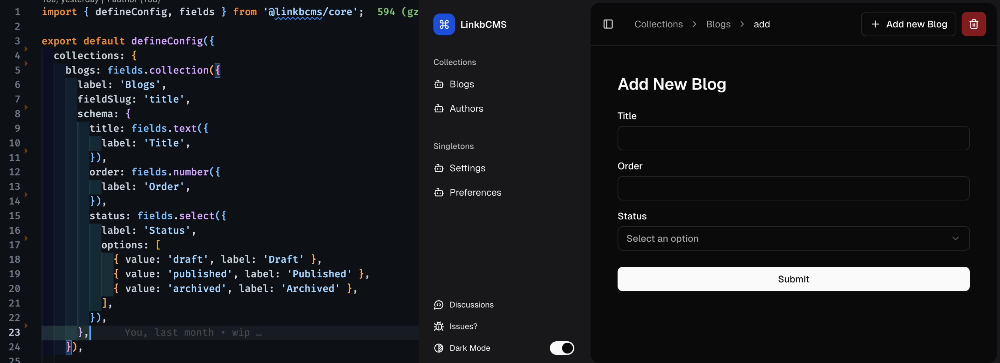

# linkbcms

[](code_of_conduct.md)

Linkbcms is a Next.js native CMS that can install directly in your existing /app folder. It's the continuation of the era for headless CMS.



## Quick Start

```bash
pnpm dlx @linkbcms/cli create-app my-app
```

## Documentation

Visit <https://linkbcms.com/docs> to view the documentation.

## Contributing

Please read the [CONTRIBUTING.md](CONTRIBUTING.md) file for details on our code of conduct, and the process for submitting pull requests to us.

## License

This project is licensed under the MIT License - see the [LICENSE.md](LICENSE.md) file for details.
